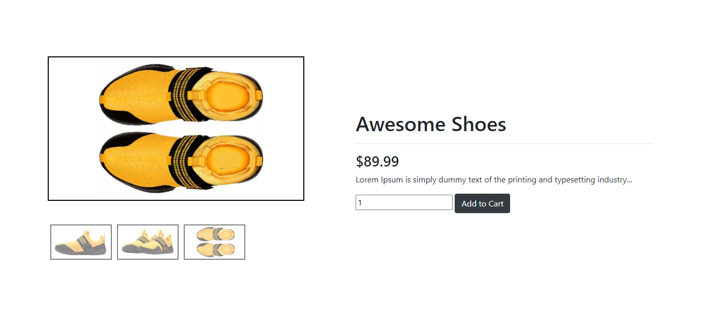
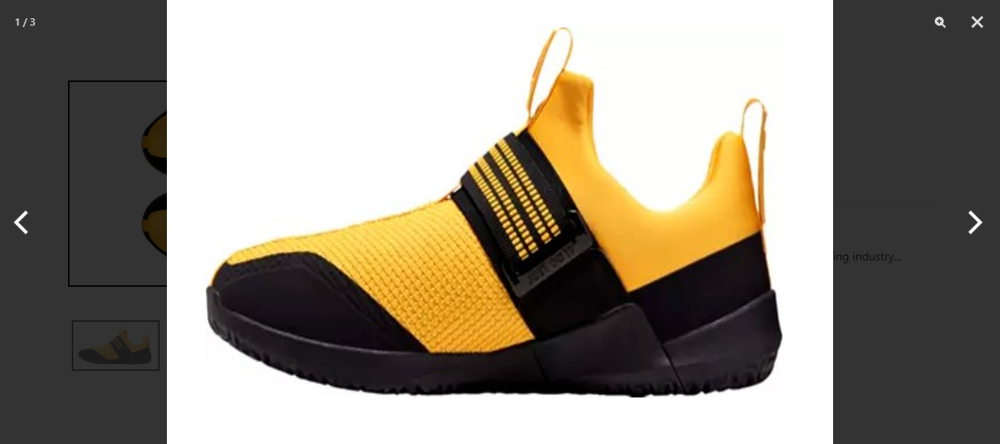

# Slider with PhotoSwipe - README

## Overview
This project is an interactive **image slider** with a product showcase, built using **HTML, CSS, and JavaScript**. It features **PhotoSwipe** for image zooming and gallery functionality, making it perfect for **e-commerce product displays**.

## Features
- **Responsive Image Slider**: Displays a large featured image with a **thumbnail gallery**.
- **PhotoSwipe Integration**: Allows **zooming and swiping** on mobile and desktop.
- **Bootstrap UI Elements**: Uses Bootstrap badges and buttons.
- **Flexible Layout**: Built using CSS **flexbox** for responsiveness.

## Technologies Used
- **HTML5**
- **CSS3 (with Bootstrap 4.5)**
- **PhotoSwipe (v5.2.2)**
- **JavaScript (for interactivity)**

## Installation & Setup
1. **Clone the repository:**
   ```sh
   git clone https://github.com/your-username/repo-name.git
   ```
2. **Navigate to the project folder:**
   ```sh
   cd repo-name
   ```
3. **Open `index.html` in your browser.**

## Usage
- Click on **thumbnails** to change the featured image.
- Click on the **featured image** to open it in **PhotoSwipe**.
- Use the **arrows, zoom, and close buttons** in PhotoSwipe for navigation.

## File Structure
```
repo-name/
│-- index.html           # Main HTML file
│-- example_1_style.css  # CSS styles
│-- example_1_slider.js  # JavaScript for slider functionality
│-- images/              # Folder containing images
│-- README.md            # Documentation
```

## Customization
- **Change the images** in the `images/` folder and update paths in `index.html`.
- Modify `example_1_style.css` to adjust styles.
- Edit `example_1_slider.js` to add more functionalities.

## Dependencies
- **Bootstrap 4.5** (CDN)
- **PhotoSwipe 5.2.2** (CDN)

## License
This project is **open-source** under the MIT License.

## Author
Developed by **[Osama Aslam]**. Contributions and suggestions are welcome!


### Click image in "gallery" to appear in "image-container"

1. 

### Click on image in "image-container" to render PhotoSwipe Gallery

2. 

---